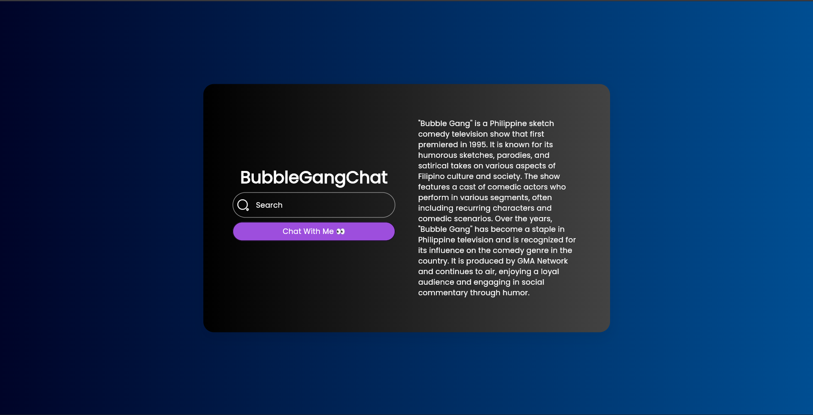

# 🤖 AI Chatbot - Flutter GPT Integration

A modern, production-ready AI chatbot built with Flutter that integrates with **GPT-4o-mini** (OpenAI) through an API proxy. Features a beautiful dark-themed UI with markdown support and smooth animations.

[](https://flutter.dev)
[](https://dart.dev)
[](LICENSE)

## ✨ Features

- 🎨 **Modern UI** - Glassmorphism design with immersive full-screen background
- 🤖 **GPT-4o-mini Integration** - Powered by OpenAI's efficient model
- 📝 **Markdown Support** - Renders formatted responses from GPT
- 🎭 **Smooth Animations** - Lottie loading animations for better UX
- 🌙 **Dark Theme** - Eye-friendly dark mode throughout the app
- 📱 **Responsive** - Works on different screen sizes
- 🔒 **Secure** - API keys managed via `.env` file

## 📸 Screenshots



## 🚀 Tech Stack

- **Framework:** Flutter 3.x
- **State Management:** Riverpod
- **API Integration:** HTTP + OpenAI GPT-4o-mini
- **Markdown Rendering:** `gpt_markdown`
- **Animations:** Lottie
- **Icons:** Iconsax
- **Environment Variables:** flutter_dotenv

## 📋 Prerequisites

- Flutter SDK (3.x or higher)
- Dart SDK (3.x or higher)
- OpenAI API key (or compatible proxy endpoint)

# 🤖 AI Chatbot App

A Flutter-based AI chatbot application powered by OpenAI's GPT-4 API. Built with Riverpod for state management and clean architecture principles.

## 📸 Features

- **Real-time AI Chat** - Get instant responses from GPT-4o-mini
- **Beautiful UI** - Dark mode with responsive design
- **Error Handling** - Graceful error management with timeout protection
- **Markdown Support** - AI responses rendered with proper markdown formatting
- **Loading States** - Smooth Lottie animations during API calls
- **Clean Architecture** - Service → Provider → UI separation

## 🛠️ Tech Stack

| Layer | Technology |
|---|---|
| Framework | Flutter (Dart) |
| State Management | Riverpod 2.x |
| HTTP Client | http package |
| Markdown Rendering | gpt_markdown |
| Animations | Lottie |
| Icons | Iconsax |
| Environment Config | flutter_dotenv |

## 📁 Project Structure

```
lib/
├── core/
│   ├── const/
│   │   └── app_sizes.dart      # All spacing/sizing constants (4dp grid)
│   ├── extensions/
│   │   └── app_extensions.dart # BuildContext extensions
│   └── theme/
│       └── app_theme.dart      # Dark theme configuration
├── data/
│   ├── provider/
│   │   ├── api_provider.dart    # ApiService provider
│   │   └── fetchessage.dart     # Chat state management
│   └── service/
│       └── api_service.dart     # OpenAI API integration
├── features/
│   ├── pages/
│   │   └── home_page.dart       # Main chat UI
│   └── widgets/
│       └── my_textfield.dart    # Custom text input
└── main.dart
```

## 🚀 Getting Started

### Prerequisites
- Flutter 3.10+
- Dart 3.0+
- OpenAI API key (or compatible LLM provider)

### Installation

1. **Clone the repository**
   ```bash
   git clone https://github.com/dartrox404/ai_chatbot.git
   cd ai_chatbot
   ```

2. **Install dependencies**
   ```bash
   flutter pub get
   ```

3. **Create `.env` file** in project root:
   ```env
   APIKEY=your_openai_api_key_here
   URL=https://api.openai.com/v1/chat/completions
   ```

4. **Run the app**
   ```bash
   flutter run --release
   ```

## 🔧 Configuration

### Environment Variables (`.env`)
```env
APIKEY=sk-proj-xxxxxxxxxxxxxxxx  # Your OpenAI API key
URL=https://api.openai.com/v1/chat/completions  # API endpoint
```

### Theme Customization
Edit `lib/core/theme/app_theme.dart` to modify:
- Colors (primary, secondary, tertiary)
- Typography (font sizes, weights)
- Text styles (display, headline, body, label)

## 📚 Key Learnings

1. **Riverpod StateNotifier Pattern** - How to manage async state with proper loading/error handling
2. **Environment Configuration** - Using `.env` files for sensitive API keys
3. **Error Handling** - Implementing timeout protection and graceful error messages
4. **Clean Architecture** - Separating services, providers, and UI layers
5. **Naming Conventions** - Importance of consistent, industry-standard naming

## ⚠️ Known Limitations

- API calls limited by OpenAI rate limits
- No conversation history persistence (stateless per session)
- Requires internet connection
- Single-user experience (no authentication)

## 🚀 Future Enhancements

- [ ] Conversation history with local storage
- [ ] Multiple AI model selection
- [ ] User authentication & cloud sync
- [ ] Voice input/output support
- [ ] Message export functionality
- [ ] Prompt templates/presets

## 📝 Dependencies

```yaml
dependencies:
  flutter_riverpod: ^2.x.x
  flutter_dotenv: ^5.x.x
  http: ^1.x.x
  gpt_markdown: ^x.x.x
  lottie: ^x.x.x
  iconsax: ^x.x.x
  gap: ^x.x.x
```

## 🤝 Contributing

This is a personal learning project. Feel free to fork and submit PRs for improvements.

## 📄 License

MIT License - see LICENSE file

## 👨‍💻 Author

**Arslan Javed**
- GitHub: [@dartrox404](https://github.com/dartrox404)
- Email: arslanjaved57420@gmail.com
- LinkedIn: [Arslan Javed](https://linkedin.com/in/arslan-javed)

---

**Built with ❤️ using Flutter**
```
